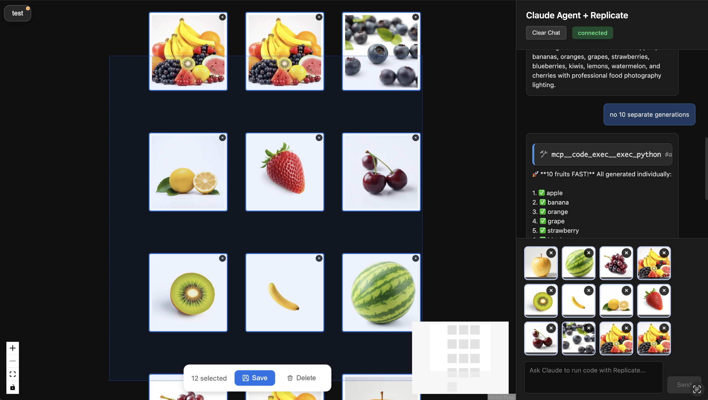

# Claude Agent + Replicate API

Interactive canvas UI for generating AI images using Claude Agent SDK and Replicate models.

## Motivation

Exploring loading context progressively via Skills on API platforms like Replicate where tool discovery is an issue. I use code act pattern with Claude Agent SDK. Controlling scope of this prototype here so it feels similar to those in https://github.com/anthropics/claude-agent-sdk-demos/

## Overview

- **Frontend**: React Flow canvas with chat panel
- **Backend**: Python WebSocket server + Claude Agent SDK
- **AI**: Replicate image generation models

## Screenshot



## Quick Start

### Installation

```bash
# Install dependencies
pip install -r requirements.txt
npm install

# Setup environment
cp .env.example .env
# Edit .env with your API keys:
# - ANTHROPIC_API_KEY
# - REPLICATE_API_TOKEN
# - STORAGE_DIR (optional, defaults to 'data/')
```

### Running

```bash
# With PM2
npm run dev:pm2

# Or manually in separate terminals
python3 backend/server.py
npm run dev
```

Access at http://localhost:5173

## Features

- Chat-based image generation using Replicate models
- Draggable canvas with React Flow
- Real-time WebSocket communication
- Redux state management

## Stack

- React 19, Redux Toolkit, React Flow, Vite
- Python 3.12, Claude Agent SDK, Replicate API
- WebSockets, PM2
